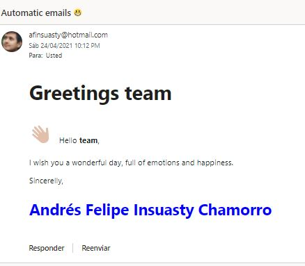
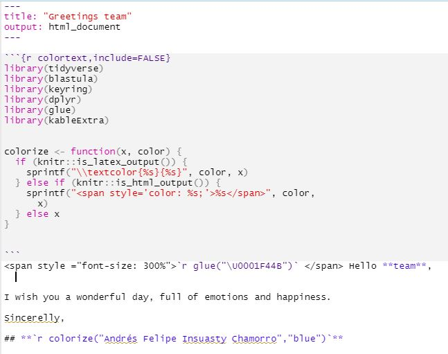

```{css,echo = FALSE}
.blocks_style {
  font-weight: bold;
  background-color: whitesmoke;
  color: black;
  font-style: italic;
  font-family: Monospace;
}
```

```{r, echo=FALSE}
knitr::opts_chunk$set(class.source = "blocks_style")

```

# Automatic reports through emails 📧

Impress your boss with automatic reports in their emails.

Packages required:

1.  `blastula`: Package to send emails
2.  `keyring`: Set credentials of email 🔐
3.  `Rmardown`: Create automatic reports

### Read Rmarkdown file

set directory of your Rmarkdown file
```{r eval = FALSE}
tempreport <- file.path(...) 
```

### Render mail with tempfile

```{r eval = FALSE}
email <- blastula::render_email(input = tempreport)
```

### send email

*credentials are explained at the end of the post!

> ``` r
> email %>% blastula::smtp_send(from="from.username@hotmail.com",
> to="to.username@hotmail.com", # c() to send 2 or more
> subject = glue("Automatic emails \U0001F600"),
> credentials=creds_key("outlook"), # given in credentials
> verbose = FALSE)
> ```



### \*Credentials

Emails are sent throught smtp, this requires a port (specified by your company or by email vendor - for outlook is 587).

```{r}
# blastula::create_smtp_creds_key(
  # "outlook","your.username@hotmail.com",provider = "outlook",port = 587)`
```


