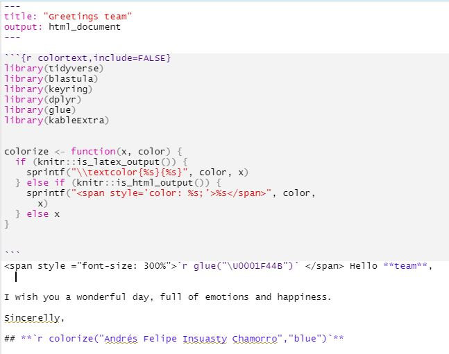

# Automatic reports through emails 📧

Impress your boss with automatic reports in their emails.

Packages required:

1.  `blastula`: Package to send emails
2.  `keyring`: Set credentials of email 🔐
3.  `Rmardown`: Create automatic reports

### Read Rmarkdown file

tempreport \<- file.path(...) \# set directory of your Rmarkdown file

### Render mail with tempfile

email\<-blastula::render_email(input = tempreport)

### send email

\*credentials are explained at the end of the post!

> ``` r
> email %>% blastula::smtp_send(from="from.username@hotmail.com",
> to="to.username@hotmail.com", # c() to send 2 or more
> subject = glue("Automatic emails \U0001F600"),
> credentials=creds_key("outlook"), # given in credentials
> verbose = FALSE)
> ```



### \*Credentials

Emails are sent throught smtp, this requires a port (specified by your company or by email vendor - for outlook is 587).

`# blastula::create_smtp_creds_key("outlook","your.username@hotmail.com",provider = "outlook",port = 587)`
